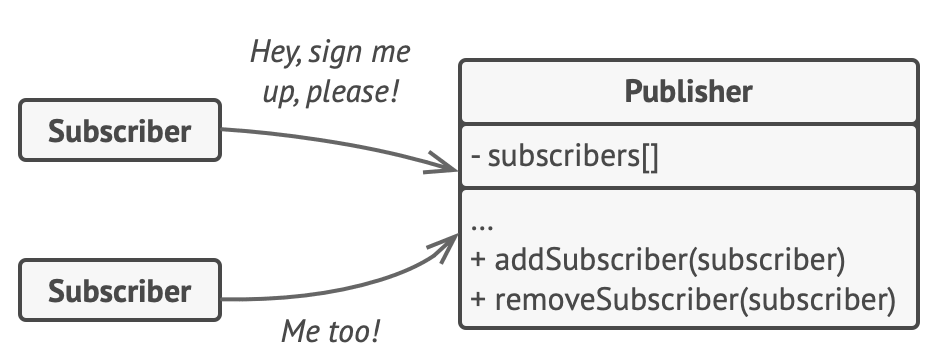

<!-- _footer: Photo by <a href="https://unsplash.com/@claybanks?utm_content=creditCopyText&utm_medium=referral&utm_source=unsplash">Clay Banks</a> on <a href="https://unsplash.com/photos/traffic-light-on-red-light-mo_VkVzwBSc?utm_content=creditCopyText&utm_medium=referral&utm_source=unsplash">Unsplash</a> -->

# Les Signaux démystifiés


<small>[Fabian Vilers](https://github.com/fvilers)
Dev Day 2024</small>


<style scoped>
h1 {
    padding-top: 1.5em;
}
small {
    font-size: 0.8rem;
}
p img {
  bottom: 0.8rem;
  position: absolute;
  right: 0.8rem;
}
</style>

---

# Qui suis-je

- Développeur chevronné depuis plus de 25 ans
- [Freelance](https://www.dev-one.com/) depuis presque 15 ans
- Entrepreneur, passionné du web, photographe amateur, père de deux filles, gamer, et l'humain d'un Akita Inu
- Suivez moi (@fvilers) sur [GitHub](https://github.com/fvilers), [Twitter](https://twitter.com/fvilers), ou [Instagram](https://www.instagram.com/fvilers)
- Soyons connectés sur [LinkedIn](https://www.linkedin.com/in/fvilers)

---

# Exemple 1

```typescript
let count = 0;
const double = count * 2;

console.log(double);
count = 10;
console.log(double);
count = 20; // Nothing happens!
```

Exécution :

```bash
0
0
```

---

# Exemple 2

```typescript
let count = 0;
const double = () => count * 2;

console.log(double());
count = 10;
console.log(double());
count = 20; // Nothing happens!
```

Exécution :

```bash
0
20
```

---

# Observer pattern



<!-- _footer: Source: https://refactoring.guru/design-patterns/observer -->

---

# Exemple 3

```typescript
const button = document.querySelector("button");

button.addEventListener("click", () => {
  console.log("Clicked");
});
```

Exécution :

```bash
Clicked
Clicked
Clicked
...
```

---

# Exemple 4

```typescript
const observer = observable(0);
const unsubscribe = observer.subscribe((value) => console.log(value));

observer.update(10);
observer.update(20);

unsubscribe();
```

Exécution :

```bash
10
20
```

---

# Signals

- Ressemblent à s'y méprendre aux observables
- Émettent des événements
- Sont un système hybride de "push" et "pull"
- Peu intéressant sans leur complément : les effects

---

# Exemple 5

Écrivons un peu de code, certes naïf, mais permettant d'implémenter un signal, un effet, et un dérivé moins de 40 lignes de JavaScript.

---

# Resources pour continuer

- [JavaScript Signals standard proposal](https://github.com/tc39/proposal-signals)
- [Signals Preact guide](https://preactjs.com/guide/v10/signals)
- [SolidJS Signals introduction](https://www.solidjs.com/tutorial/introduction_signals)
- [Angular Signals](https://angular.dev/guide/signals)
